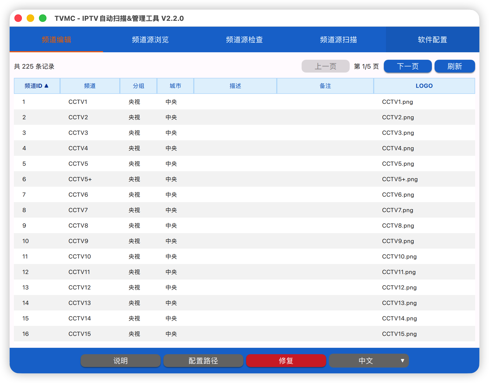
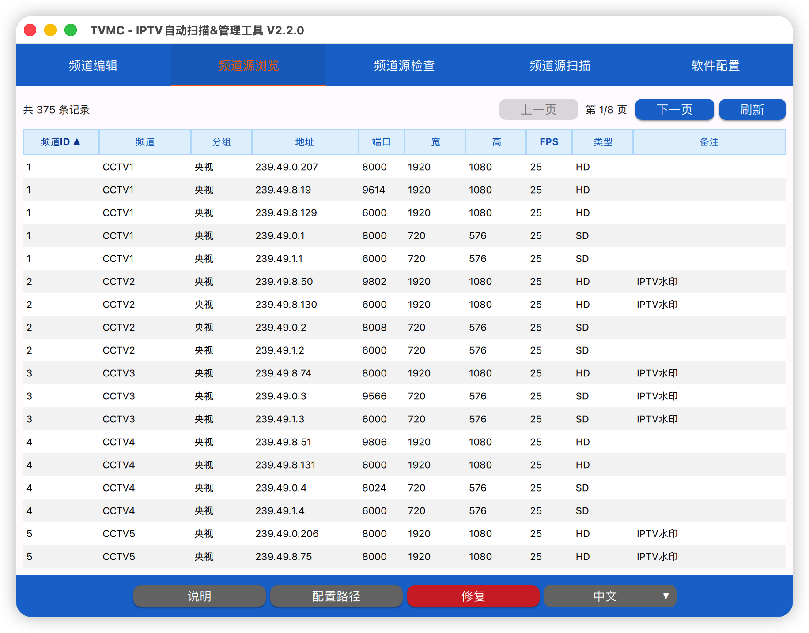
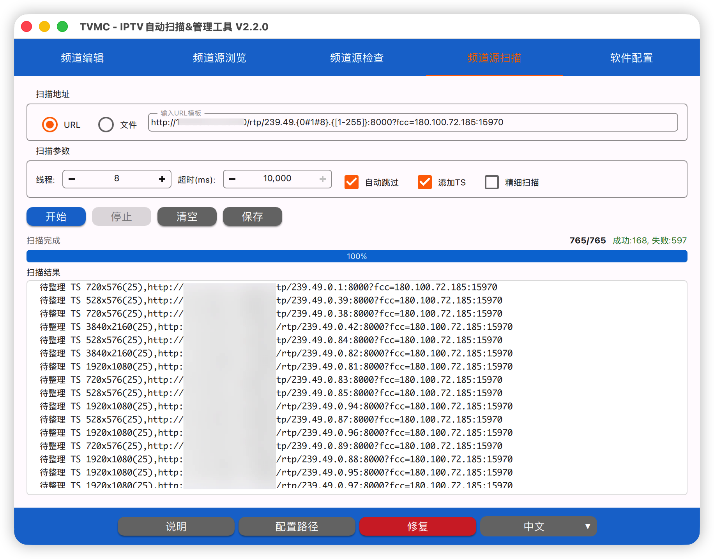

# TVMC - IPTV自动扫描&管理工具

<div align="center">

**一款专业的IPTV频道管理和流媒体扫描工具，支持多格式导入、频道ID自动同步、批量扫描**

[](https://www.gnu.org/licenses/gpl-3.0)
[](https://www.qt.io)
[](https://www.apple.com/macos/)

</div>

**中文** | [English](README_EN.md)

## 📖 简介

TVMC 是一款功能强大的IPTV频道管理和流媒体扫描工具，将频道管理和流媒体扫描整合到一个应用中。软件采用现代化的 QML 界面，提供直观的频道管理、流媒体检测和批量扫描功能。

本项目使用 MiMoCode（小米自研 mimo-v2.5-pro 大模型）进行代码生成和优化。

## 📸 界面预览

<div align="center">

**频道编辑**



**频道源浏览**



**频道源检查**


**频道源扫描**



**软件配置**


</div>

## ✨ 功能特性

### 📺 频道管理

| 功能 | 说明 |
|------|------|
| **频道编辑** | 支持频道ID、名称、分组、城市、描述、备注、LOGO的编辑 |
| **频道源浏览** | 分页显示所有频道和信号源，支持表头排序 |
| **频道源检查** | 检测信号源质量，查看视频预览，检测值标红提示 |
| **多格式导入** | 支持 .mc、.m3u、.txt 三种格式导入 |
| **多格式导出** | 支持 M3U、TXT、XLS、CSV 格式导出 |
| **频道ID同步** | 从EPG指南自动下载并同步频道ID |

### 🔍 流媒体扫描

| 功能 | 说明 |
|------|------|
| **批量扫描** | 支持URL模板和文件导入两种模式 |
| **多线程** | 可配置并发线程数量（1-128） |
| **地址模板** | 支持花括号范围表达式（如 239.49.{0#1#2}） |
| **实时进度** | 显示扫描进度和成功/失败统计 |
| **结果导出** | 支持将扫描结果导出为 .mc 文件 |
| **IP去重** | 发现相同IP已有成功地址后自动跳过 |
| **精细扫描** | EIO错误时减半超时重试 |

### 🌍 多语言支持

- 支持中文/英文界面切换
- 底部工具栏一键切换语言，自动重启应用

## 🖥️ 系统要求

- **操作系统**：macOS 12.0、Windows 10或更高版本
- **Qt 版本**：Qt 6.8.3
- **编译器**：Xcode Command Line Tools (Apple Clang)
- **构建工具**：CMake 3.19+
- **FFmpeg**：avformat、avutil、avcodec、swscale

## 📦 安装与构建

### 从源码构建

```bash
# 克隆仓库
git clone https://github.com/zuozl1992/iptv_manager_scanner.git
cd iptv_manager_scanner

# 进入项目目录
cd TVMC

# 创建构建目录
mkdir build && cd build

# 配置 CMake（指定 Qt 安装路径）
cmake .. -DCMAKE_PREFIX_PATH=~/Qt/6.8.3/macos

# 编译
cmake --build .

# 运行
./TVMC.app/Contents/MacOS/TVMC
```

### 安装依赖

**Qt 6.8.3**

1. 从 [Qt 官网](https://www.qt.io/download) 下载 Qt Online Installer
2. 安装 Qt 6.8.3，勾选以下组件：
   - Qt 6.8.3 for macOS
   - Qt Network
   - Qt SQL

**FFmpeg**

```bash
brew install ffmpeg
```

## 🏗️ 项目结构

```
TVMC/
├── CMakeLists.txt                    # 顶层构建文件
├── cmake/                            # CMake 辅助脚本
│   ├── FindFFmpeg.cmake
│   └── Platform.cmake
├── src/
│   ├── core/                         # 核心模块
│   │   ├── config/                   # 配置管理
│   │   └── logging/                  # 日志系统
│   ├── database/                     # 数据库访问层
│   ├── network/                      # 网络请求
│   ├── multimedia/                   # FFmpeg 集成
│   ├── export/                       # 导出功能
│   ├── logic/                        # 业务逻辑
│   ├── platform/                     # 平台抽象
│   └── ui/                           # 界面层（QML桥接）
│       ├── manager_backend.*         # 管理器后端
│       ├── scanner_backend.*         # 扫描器后端
│       ├── language_manager.*        # 语言管理器
│       └── models/                   # 数据模型
├── resources/
│   ├── qml/                          # QML 界面文件
│   │   ├── main.qml                  # 主窗口
│   │   ├── tabs/                     # 选项卡页面
│   │   ├── dialogs/                  # 对话框
│   │   └── IptvComponents/           # 共享组件
│   └── translations/                 # 翻译文件
└── third_party/
    └── qxlsx/                        # Excel导出库
```

## 🎯 使用指南

### 频道编辑

1. 启动应用后默认显示频道编辑页面
2. 双击单元格可编辑内容
3. 编辑后按回车或点击其他位置自动保存
4. 支持分页浏览和点击表头排序

### 频道源浏览

1. 切换到"频道源浏览"标签页
2. 查看所有频道和信号源信息
3. 点击表头可按该列排序
4. 支持分页浏览，每页50条记录

### 频道源检查

1. 切换到"频道源检查"标签页
2. 点击"启动检查"加载检测列表
3. 选择检测模式（正式频道/测试频道）
4. 下拉框选择要检测的频道
5. 左侧显示视频预览，右侧显示检测信息
6. 检测值与数据库不一致时显示红色

### 频道源扫描

1. 切换到"频道源扫描"标签页
2. 输入URL模板或选择文件
3. 设置线程数、超时时间等参数
4. 点击"开始"进行批量扫描
5. 实时显示扫描进度和结果

### 配置管理

1. 切换到"软件配置"标签页
2. 配置服务器地址（单播/Logo/FCC）
3. 配置组播地址模板和端口
4. 选择频道分组
5. 导入/导出文件

### 导入文件格式

**MC 格式**
```
频道名 类型 分辨率(帧率),http://server/udp/IP:端口
```

**M3U 格式**
```
#EXTM3U
#EXTINF:-1 tvg-name="CCTV1" group-title="央视",CCTV1 HD
http://server/udp/239.49.1.1:6000
```

**TXT 格式**
```
央视,#genre#
CCTV1,http://server/udp/239.49.1.1:6000
```

### 地址模板语法

- 零散值：`1#3` 表示 1 和 3
- 范围值：`[8-10]` 表示 8、9、10
- 混合使用：`1#3#[5-7]` 表示 1、3、5、6、7
- 最多支持3层花括号嵌套

示例：
```
http://192.168.1.1:12345/udp/239.49.0.{[1-255]}:{6000#[8000-9999]}
```

## 📝 开发说明

### 架构设计

项目采用分层架构：

```
┌─────────────────────────────────┐
│         QML UI 层               │
├─────────────────────────────────┤
│       Bridge 桥接层              │
├─────────────────────────────────┤
│        Logic 业务逻辑层          │
├─────────────────────────────────┤
│   Database/Network/Multimedia   │
├─────────────────────────────────┤
│         Core 核心层              │
└─────────────────────────────────┘
```

- **Core 层**：配置管理、日志系统
- **Database 层**：SQLite 数据库访问
- **Network 层**：HTTP 请求、Logo 获取
- **Multimedia 层**：FFmpeg 流媒体探测
- **Logic 层**：频道服务、扫描服务、URL构建
- **Bridge 层**：QObject 派生类，暴露 C++ 接口给 QML
- **UI 层**：QML 界面，通过桥接层访问后端功能

## 🤝 贡献

欢迎提交 Issue 和 Pull Request！

1. Fork 本仓库
2. 创建特性分支 (`git checkout -b feature/AmazingFeature`)
3. 提交更改 (`git commit -m 'Add some AmazingFeature'`)
4. 推送到分支 (`git push origin feature/AmazingFeature`)
5. 创建 Pull Request

## 📄 许可证

本项目采用 [GNU General Public License v3.0](https://www.gnu.org/licenses/gpl-3.0) 许可证。

```
Copyright (C) 2024 TVMC

This program is free software: you can redistribute it and/or modify
it under the terms of the GNU General Public License as published by
the Free Software Foundation, either version 3 of the License, or
(at your option) any later version.

This program is distributed in the hope that it will be useful,
but WITHOUT ANY WARRANTY; without even the implied warranty of
MERCHANTABILITY or FITNESS FOR A PARTICULAR PURPOSE.  See the
GNU General Public License for more details.

You should have received a copy of the GNU General Public License
along with this program.  If not, see <https://www.gnu.org/licenses/>.
```

## 🙏 致谢

- [Qt](https://www.qt.io/) - 跨平台应用框架
- [FFmpeg](https://ffmpeg.org/) - 多媒体处理框架
- [QXlsx](https://github.com/QtExcel/QXlsx) - Excel 导出库
- [MiMoCode](https://github.com/anthropics/claude-code) - AI 辅助代码重构工具

## 📧 联系方式

如有问题或建议，请通过以下方式联系：

- 提交 [Issue](https://github.com/zuozl1992/iptv_manager_scanner/issues)

---

<div align="center">

**⭐ 如果这个项目对你有帮助，请给个 Star 支持一下！ ⭐**

</div>
