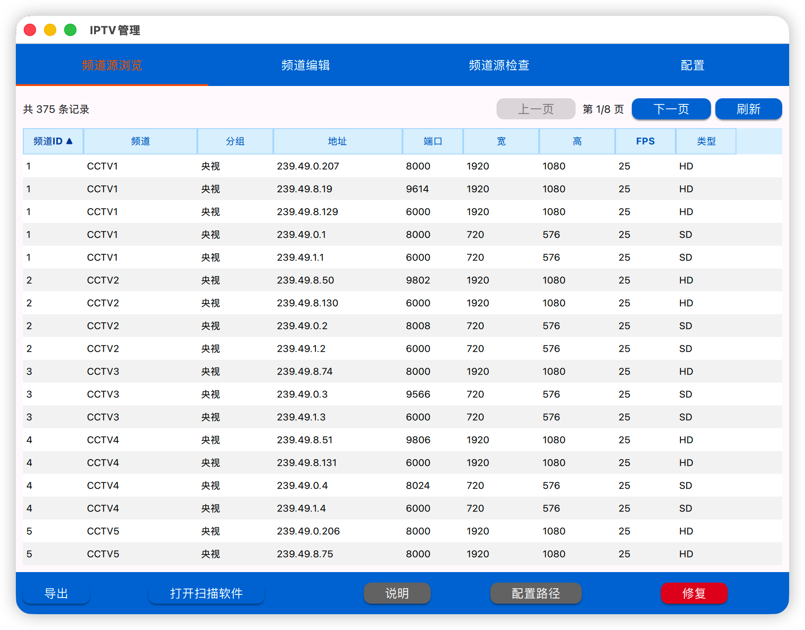
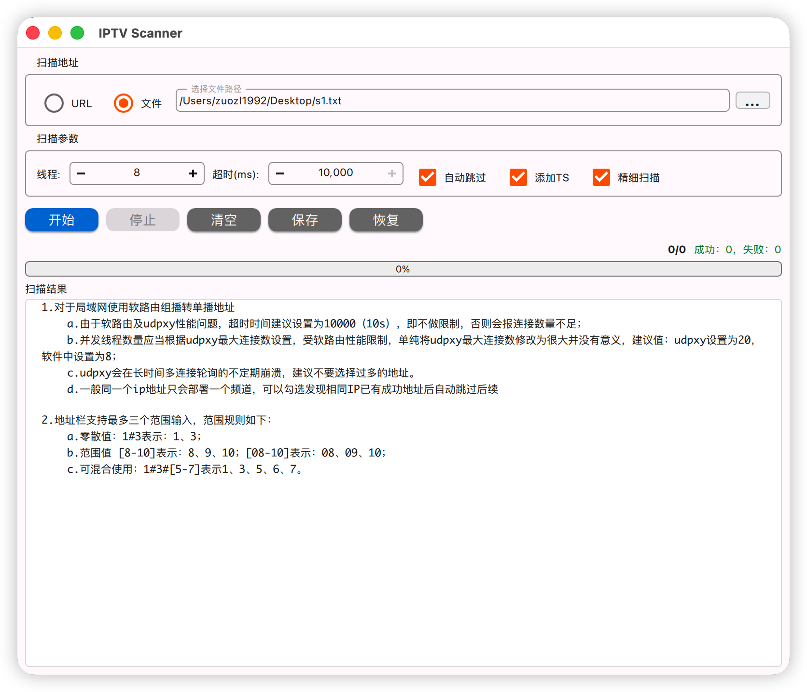

# IPTV 工具集

一套用于管理和扫描 IPTV 频道的桌面应用程序，基于 Qt6 C++ + QML 开发。

## 项目概述

本项目包含两个核心应用：

- **IPTVManager** - IPTV 频道管理工具，支持频道导入导出、流媒体探测、视频预览等功能
- **IPTVScanner** - IPTV 频道扫描工具，用于批量检测 IPTV 流媒体地址的可用性

## 项目截图

- Manager




- Scanner



## 项目结构

```
IPTV/
├── IPTVManager/              # 频道管理应用
│   ├── src/                  # 源代码
│   │   ├── core/             # 配置 + 日志模块
│   │   ├── database/         # 数据库访问层
│   │   ├── network/          # 网络请求
│   │   ├── multimedia/       # FFmpeg 集成
│   │   ├── export/           # 导出功能
│   │   ├── logic/            # 业务逻辑
│   │   ├── platform/         # 平台抽象
│   │   └── ui/               # 界面层（QML桥接）
│   ├── resources/
│   │   └── qml/              # QML 界面文件
│   │       ├── main.qml      # 主窗口
│   │       ├── tabs/         # 选项卡页面
│   │       ├── dialogs/      # 对话框
│   │       └── IptvComponents/ # 共享组件
│   ├── tests/                # 单元测试
│   └── third_party/          # 第三方库
├── IPTVScanner/              # 频道扫描应用
│   ├── src/                  # 源代码
│   │   ├── core/             # 配置 + 日志模块
│   │   ├── multimedia/       # FFmpeg 流探测
│   │   ├── logic/            # 业务逻辑
│   │   ├── platform/         # 平台抽象
│   │   └── ui/               # 界面层（QML桥接）
│   ├── resources/
│   │   └── qml/              # QML 界面文件
│   ├── tests/                # 单元测试
│   └── resources/            # 资源文件
└── release/                  # 发布脚本和资源
    ├── scripts/              # 构建和部署脚本
    ├── icons/                # 应用图标
    └── output/               # 输出目录
```

## 功能特性

### IPTVManager

**频道源浏览**
- 表格显示频道ID、名称、分组、IP地址、端口、分辨率、帧率、类型
- 点击表头排序（升序/降序切换）
- 分页浏览（每页50条）

**频道编辑**
- 就地编辑频道信息（频道ID、名称、分组、城市、描述、备注、LOGO）
- 编辑后即时保存到数据库
- 从 EPG 指南自动同步频道ID

**频道源检查**
- 检测信号源质量（分辨率、帧率、编码类型）
- 视频预览画面（16:9 比例）
- 台标显示
- 检测值与数据库不一致时标红提示
- 自动创建不存在的频道

**配置管理**
- 服务器地址配置（单播/Logo/FCC）
- 组播地址模板（支持花括号范围表达式）
- 协议选择（udp/rtp）
- 导出选项（合并频道、Logo、清晰度）
- 频道分组选择

**导入导出**
- 导入：支持 .mc、.m3u、.txt 三种格式
- 导出：M3U、TXT、CSV、XLSX 格式
- 扫描文件生成（用于 IPTVScanner）
- 频道ID自动同步（从 EPG 指南下载）

### IPTVScanner

- **批量扫描**：支持批量扫描 IPTV 流媒体地址
- **多线程**：可配置并发线程数量（1-128）
- **地址模板**：支持带范围的地址模板
- **实时进度**：显示扫描进度和成功/失败统计
- **结果导出**：支持将扫描结果导出为 .mc 文件
- **IP去重**：发现相同IP已有成功地址后自动跳过
- **精细扫描**：EIO错误时减半超时重试

## 构建要求

### 开发环境

- **操作系统**：macOS 11.0+、Windows 10+、Linux
- **编译器**：支持 C++17 的编译器
- **构建工具**：CMake 3.19+
- **Qt 版本**：Qt 6.8+（需要 Quick、QuickControls2、Sql、Network 模块）
- **FFmpeg**：avformat、avutil、avcodec、swscale

### 依赖安装

#### macOS

```bash
brew install cmake ffmpeg
# Qt 6.8 从官网下载安装
```

#### Windows

```bash
# Qt 6.8 从官网下载安装
# FFmpeg 从 https://ffmpeg.org/download.html 下载
# CMake 从 https://cmake.org/download/ 下载
```

#### Linux (Ubuntu/Debian)

```bash
sudo apt update
sudo apt install cmake qt6-base-dev qt6-declarative-dev qt6-quickcontrols2-6-dev \
    libavformat-dev libavutil-dev libavcodec-dev libswscale-dev
```

## 构建与测试

### 构建项目

```bash
# IPTVManager
cd IPTVManager
cmake -B build -DCMAKE_BUILD_TYPE=Release
cmake --build build

# IPTVScanner
cd IPTVScanner
cmake -B build -DCMAKE_BUILD_TYPE=Release
cmake --build build
```

### 运行测试

```bash
# IPTVManager
cd IPTVManager/build
ctest --output-on-failure

# IPTVScanner
cd IPTVScanner/build
ctest --output-on-failure
```

### 打包发布

```bash
cd release/scripts
./build.sh all release      # 构建
./deploy_macos.sh all       # macOS 打包
```

## 使用说明

### IPTVManager

1. **首次启动**：选择配置文件和数据库文件路径
2. **导入频道**：支持 .mc/.m3u/.txt 格式导入
3. **配置页面**：设置服务器地址、协议、导出选项
4. **频道源检查**：检测信号源质量，查看视频预览
5. **导出频道**：支持 M3U/TXT/CSV/XLSX 格式

### IPTVScanner

1. **输入地址**：在地址栏输入 IPTV 流媒体地址模板
2. **配置参数**：设置线程数量、超时时间等
3. **开始扫描**：点击开始按钮进行批量扫描
4. **查看结果**：实时查看扫描进度和成功/失败统计
5. **导出结果**：点击保存按钮导出扫描结果为 .mc 文件

### 地址模板语法

```
单个值：1 表示单个值
多个值：1#3 表示 1 和 3
范围值：[8-10] 表示 8、9、10
带前导零：[08-10] 表示 08、09、10
混合使用：1#3#[5-7] 表示 1、3、5、6、7
```

示例：
```
http://192.168.1.1:12345/udp/239.49.0.{[1-255]}:{6000#[8000-9999]}
```

## 版本历史

### v2.1.0 (2026-07-13)

**IPTVManager**
- QML 界面迁移（Qt Quick + Material Design）
- 支持 .mc/.m3u/.txt 三种格式导入
- 频道ID自动同步（从 EPG 指南下载）
- 配置页面独立选项卡
- 分页浏览、表头排序
- 检测值与数据库对比标红
- 说明对话框详细功能介绍

**IPTVScanner**
- QML 界面迁移（Qt Quick + Material Design）
- 扫描结果区域优化
- 进度条百分比修复
- 配置自动保存

### v2.0.0 (2026-06-30)

- 模块化架构重构
- Qt Widgets 界面
- FFmpeg 自动发现
- SQLite 数据库存储
- 多格式导入导出

## 开发工具

本项目使用 MiMoCode（小米自研 mimo-v2.5-pro 大模型）进行代码生成和优化。

## 许可证

本项目采用 [GNU General Public License v3.0](https://www.gnu.org/licenses/gpl-3.0.html) 开源许可证。

## 联系方式

zuozl1992@foxmail.com
