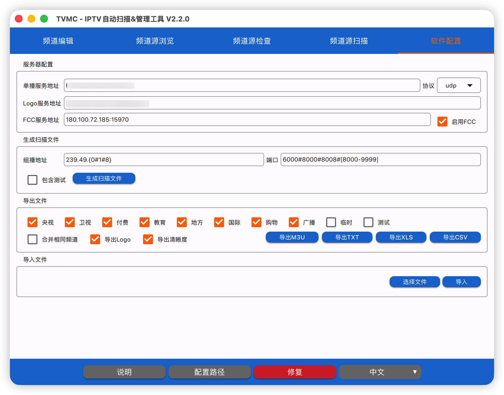

# TVMC - IPTV Auto Scan & Management Tool

<div align="center">

**A professional IPTV channel management and streaming scan tool with multi-format import, channel ID sync, and batch scanning**

[](https://www.gnu.org/licenses/gpl-3.0)
[](https://www.qt.io)
[](https://www.apple.com/macos/)

</div>

[中文](README.md) | **English**

## 📖 Introduction

TVMC is a powerful IPTV channel management and streaming scan tool that integrates channel management and streaming scanning into one application. The software features a modern QML interface, providing intuitive channel management, stream detection, and batch scanning capabilities.

This project uses MiMoCode (Xiaomi's mimo-v2.5-pro AI model) for code generation and optimization.

## 📸 Screenshots

<div align="center">

**Channel Edit**


**Channel Browse**


**Channel Check**


**Channel Scan**


**Settings**



</div>

## ✨ Features

### 📺 Channel Management

| Feature | Description |
|---------|-------------|
| **Channel Edit** | Edit channel ID, name, group, city, description, notes, and logo |
| **Channel Browse** | Paginated display of all channels and sources with sortable headers |
| **Channel Check** | Detect stream quality, preview video, highlight mismatched values |
| **Multi-format Import** | Support .mc, .m3u, .txt file formats |
| **Multi-format Export** | Export to M3U, TXT, XLS, CSV formats |
| **Channel ID Sync** | Auto-download and sync channel IDs from EPG guide |

### 🔍 Stream Scanning

| Feature | Description |
|---------|-------------|
| **Batch Scanning** | Support URL template and file import modes |
| **Multi-threading** | Configurable concurrent threads (1-128) |
| **Address Template** | Brace range expressions (e.g., 239.49.{0#1#2}) |
| **Real-time Progress** | Display scanning progress and success/failure statistics |
| **Result Export** | Export scan results to .mc files |
| **IP Deduplication** | Auto-skip IPs with existing successful addresses |
| **Fine Scanning** | Halve timeout on EIO errors for retry |

### 🌍 Multi-language Support

- Chinese/English interface switching
- One-click language switch in bottom toolbar with auto-restart

## 🖥️ System Requirements

- **Operating System**: macOS 12.0、Windows 10 or later
- **Qt Version**: Qt 6.8.3
- **Compiler**: Xcode Command Line Tools (Apple Clang)
- **Build Tool**: CMake 3.19+
- **FFmpeg**: avformat, avutil, avcodec, swscale

## 📦 Installation & Build

### Build from Source

```bash
# Clone repository
git clone https://github.com/zuozl1992/iptv_manager_scanner.git
cd iptv_manager_scanner

# Enter project directory
cd TVMC

# Create build directory
mkdir build && cd build

# Configure CMake (specify Qt installation path)
cmake .. -DCMAKE_PREFIX_PATH=~/Qt/6.8.3/macos

# Build
cmake --build .

# Run
./TVMC.app/Contents/MacOS/TVMC
```

### Install Dependencies

**Qt 6.8.3**

1. Download Qt Online Installer from [Qt官网](https://www.qt.io/download)
2. Install Qt 6.8.3 with the following components:
   - Qt 6.8.3 for macOS
   - Qt Network
   - Qt SQL

**FFmpeg**

```bash
brew install ffmpeg
```

## 🏗️ Project Structure

```
TVMC/
├── CMakeLists.txt                    # Top-level build file
├── cmake/                            # CMake helper scripts
│   ├── FindFFmpeg.cmake
│   └── Platform.cmake
├── src/
│   ├── core/                         # Core module
│   │   ├── config/                   # Configuration management
│   │   └── logging/                  # Logging system
│   ├── database/                     # Database access layer
│   ├── network/                      # Network requests
│   ├── multimedia/                   # FFmpeg integration
│   ├── export/                       # Export functionality
│   ├── logic/                        # Business logic
│   ├── platform/                     # Platform abstraction
│   └── ui/                           # UI layer (QML bridge)
│       ├── manager_backend.*         # Manager backend
│       ├── scanner_backend.*         # Scanner backend
│       ├── language_manager.*        # Language manager
│       └── models/                   # Data models
├── resources/
│   ├── qml/                          # QML UI files
│   │   ├── main.qml                  # Main window
│   │   ├── tabs/                     # Tab pages
│   │   ├── dialogs/                  # Dialogs
│   │   └── IptvComponents/           # Shared components
│   └── translations/                 # Translation files
└── third_party/
    └── qxlsx/                        # Excel export library
```

## 🎯 User Guide

### Channel Edit

1. Launch the app, the Channel Edit page is displayed by default
2. Double-click a cell to edit content
3. Press Enter or click elsewhere to save automatically
4. Support pagination and click-to-sort headers

### Channel Browse

1. Switch to "Channel Browse" tab
2. View all channels and signal source information
3. Click table headers to sort by column
4. Support pagination, 50 records per page

### Channel Check

1. Switch to "Channel Check" tab
2. Click "Start Check" to load check list
3. Select check mode (Normal/Test)
4. Select channel from dropdown
5. Left side shows video preview, right side shows check info
6. Mismatched values are highlighted in red

### Channel Scan

1. Switch to "Channel Scan" tab
2. Enter URL template or select file
3. Set threads, timeout, and other parameters
4. Click "Start" to begin batch scanning
5. Real-time display of scan progress and results

### Settings

1. Switch to "Settings" tab
2. Configure server addresses (Unicast/Logo/FCC)
3. Configure multicast address template and port
4. Select channel groups
5. Import/Export files

### Import File Formats

**MC Format**
```
ChannelName Type Resolution(FPS),http://server/udp/IP:Port
```

**M3U Format**
```
#EXTM3U
#EXTINF:-1 tvg-name="CCTV1" group-title="央视",CCTV1 HD
http://server/udp/239.49.1.1:6000
```

**TXT Format**
```
央视,#genre#
CCTV1,http://server/udp/239.49.1.1:6000
```

### Address Template Syntax

- Values: `1#3` means 1 and 3
- Range: `[8-10]` means 8, 9, 10
- Mixed: `1#3#[5-7]` means 1, 3, 5, 6, 7
- Support up to 3 nested brace levels

Example:
```
http://192.168.1.1:12345/udp/239.49.0.{[1-255]}:{6000#[8000-9999]}
```

## 📝 Development

### Architecture Design

The project uses a layered architecture:

```
┌─────────────────────────────────┐
│         QML UI Layer            │
├─────────────────────────────────┤
│       Bridge Layer              │
├─────────────────────────────────┤
│        Logic Layer              │
├─────────────────────────────────┤
│   Database/Network/Multimedia   │
├─────────────────────────────────┤
│         Core Layer              │
└─────────────────────────────────┘
```

- **Core Layer**: Configuration management, logging system
- **Database Layer**: SQLite database access
- **Network Layer**: HTTP requests, logo fetching
- **Multimedia Layer**: FFmpeg stream probing
- **Logic Layer**: Channel service, scan service, URL building
- **Bridge Layer**: QObject-derived classes exposing C++ interfaces to QML
- **UI Layer**: QML interface, accessing backend through bridge layer

## 🤝 Contributing

Welcome to submit Issues and Pull Requests!

1. Fork this repository
2. Create feature branch (`git checkout -b feature/AmazingFeature`)
3. Commit changes (`git commit -m 'Add some AmazingFeature'`)
4. Push to branch (`git push origin feature/AmazingFeature`)
5. Create Pull Request

## 📄 License

This project is licensed under the [GNU General Public License v3.0](https://www.gnu.org/licenses/gpl-3.0).

```
Copyright (C) 2024 TVMC

This program is free software: you can redistribute it and/or modify
it under the terms of the GNU General Public License as published by
the Free Software Foundation, either version 3 of the License, or
(at your option) any later version.

This program is distributed in the hope that it will be useful,
but WITHOUT ANY WARRANTY; without even the implied warranty of
MERCHANTABILITY or FITNESS FOR A PARTICULAR PURPOSE.  See the
GNU General Public License for more details.

You should have received a copy of the GNU General Public License
along with this program.  If not, see <https://www.gnu.org/licenses/>.
```

## 🙏 Acknowledgments

- [Qt](https://www.qt.io/) - Cross-platform application framework
- [FFmpeg](https://ffmpeg.org/) - Multimedia processing framework
- [QXlsx](https://github.com/QtExcel/QXlsx) - Excel export library
- [MiMoCode](https://github.com/anthropics/claude-code) - AI-assisted code refactoring tool

## 📧 Contact

If you have any questions or suggestions, please contact us through:

- Submit [Issue](https://github.com/zuozl1992/iptv_manager_scanner/issues)

---

<div align="center">

**⭐ If this project helps you, please give a Star to support! ⭐**

</div>
